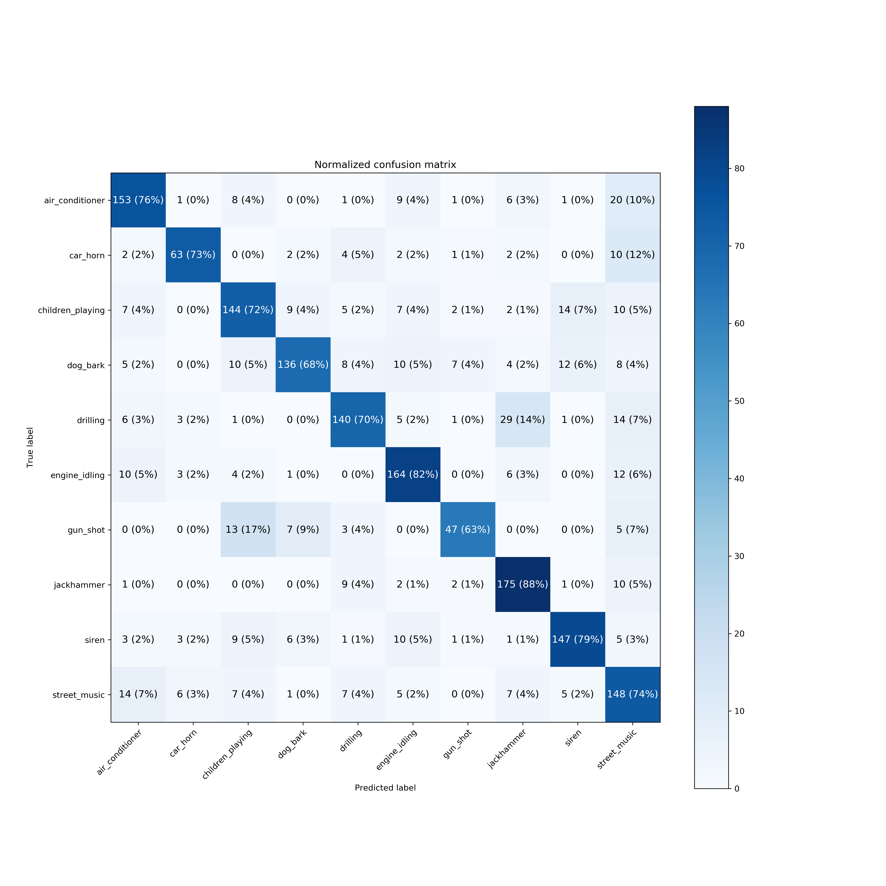
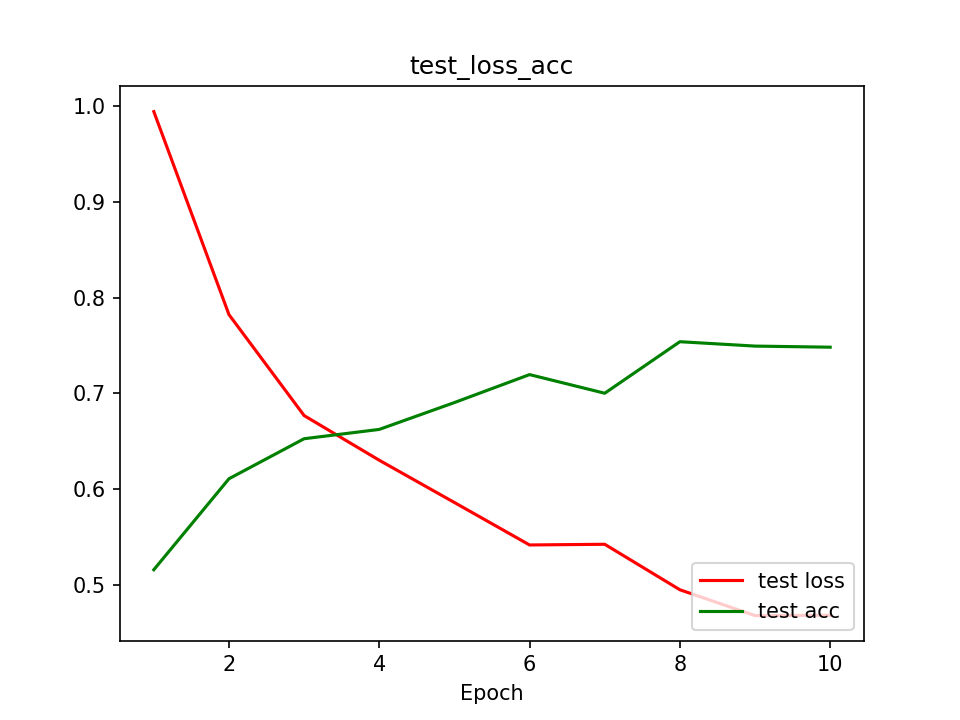

# Sound_Classficiation

This repository have a practice result of sound classification using UrbanSound8K dataset.

## Requirements
* python3.6+
* pytorch 1.6.0
* others.

## Usage
training a model
```bash
python3 main.py --config config.yml
```

testing a model
```bash
Not implmented yet
```

## Results

####The result from a model using cross entropy  

####The result from a model using focal loss


## Reference
1. https://mikesmales.medium.com/sound-classification-using-deep-learning-8bc2aa1990b7
2. https://github.com/mikesmales/Udacity-ML-Capstone
3. https://github.com/clcarwin/focal_loss_pytorch